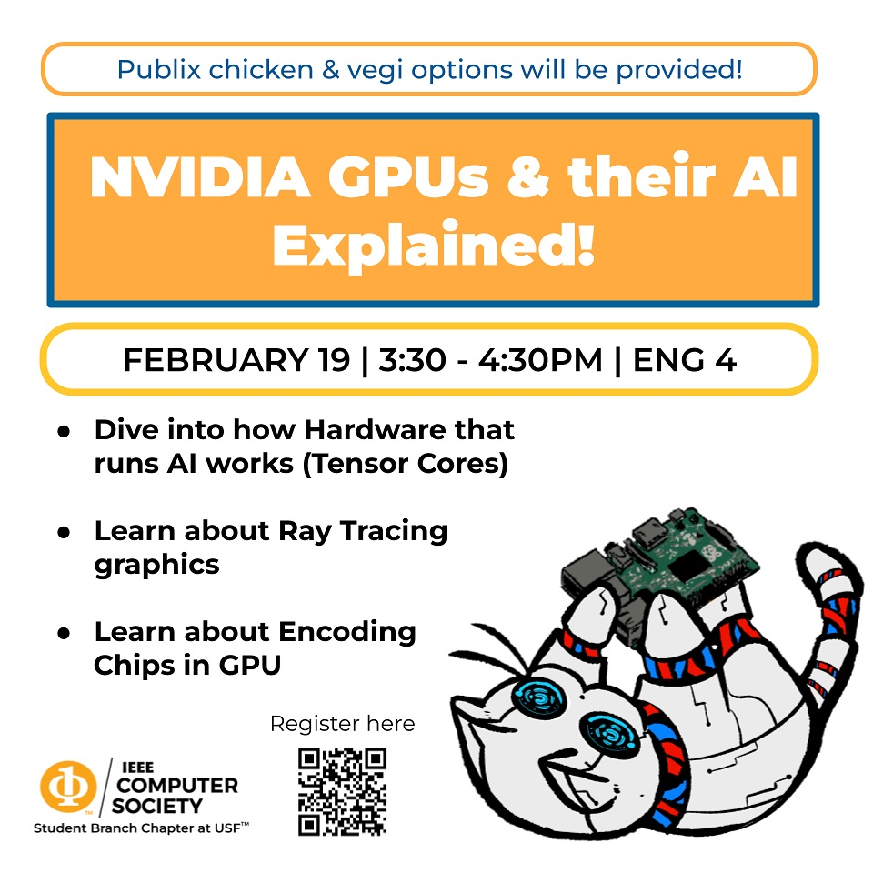

# NVIDIA GPUs & their AI Explained

A hardware talk by Liam, hardware lead at the IEEE Computer Society student branch chapter at the University of South Florida and a student research assistant at the USF Interface Research Lab.

Wednesday, February 19, 2025, 3:30 to 4:30 PM, ENG 4.

## What the talk covered

- Tensor cores, and what actually makes a GPU good at running AI workloads.
- Ray tracing, and how it differs from how graphics were rendered before.
- The encoding chips on the die, the part nobody talks about until a stream drops frames.
- How NVIDIA got from graphics cards to the middle of the AI industry.

No hardware background needed to follow it.

## Files

- `NVIDIA GPUs and AI Hardware.pdf`, the full slide deck.

## Links

- [Announcement on Instagram](https://www.instagram.com/p/DF9YaHZuahg/)
- [Recap on Instagram](https://www.instagram.com/p/DGzRuMGxo2s/)
